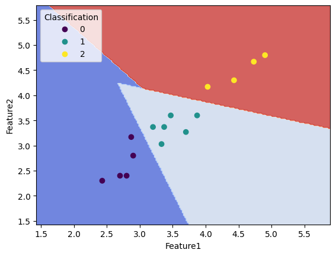
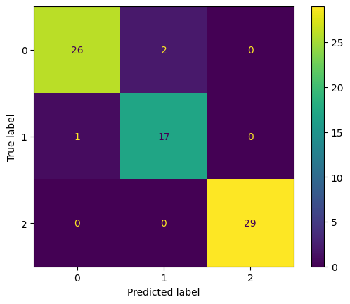
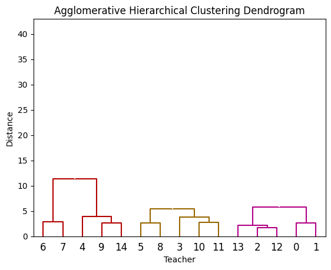
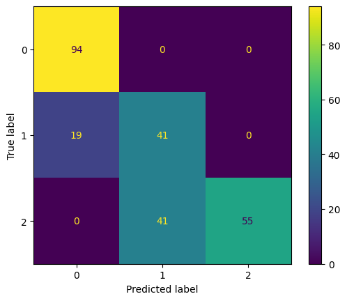
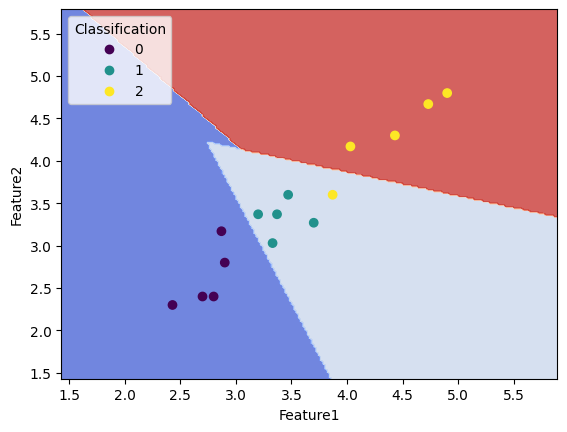
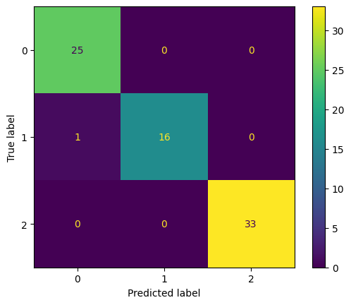

This repository contains code to a project, which aims to evaluate three machine learning algorithms:

1. [Supervised, Support Vector Machine](./code/Teacher_Review__SVM.ipynb)
2. [Unsuperised, Agglomerative Hierarchical Clustering](./code/Teacher_Review_Clustering.ipynb)
3. [Semi-supervised, Self-Training Classifier](./code/Teacher_Review_Semi_Supervised.ipynb)

# Dataset Information
## Training Dataset
> The dataset was synthetically generated by hand. The real one from the college couldn't be used for privacy reasons.

- There are a total of 450 entries, comprising of 15 teachers, with each teacher having 30 review entries to their name.
- Take a look: [CSV](./benchmark_dataset.csv)

## Testing / Benchmark Dataset
> The dataset was synthetically generated by hand. The real one from the college couldn't be used for privacy reasons.

- A uniform benchmark dataset of 250 entries has been used to test the performance of the models and analyse their performance.
- The structure is similar to the training dataset.
- Take a look: [CSV](./final_complete_teacher_dataset.csv)

## Evaluation Metrics
- The performance of the algorithms has been tested against the benchmark dataset.
- Confusion Matrix:
  - **Supervised (Support Vector Machine)**
    - Predictions:  
    - Confusion Matrix:  
  - **Unsupervised (Agglomerative Hierarchical Clustering)**
    - Predictions:  
    - Confusion Matrix:  
  - **Semi-supervised (Self-Training Classifier)**
    - Predictions:  
    - Confusion Matrix:  